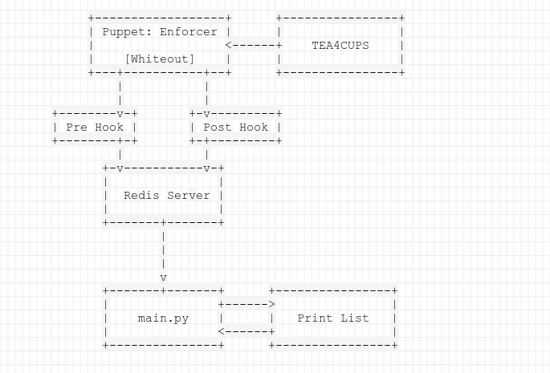

# Print List
Displays the print queue of Berkeley OCF printers on a web page for easy viewing.

> **Dependencies:** redis, flask, gunicorn

### Developer Environment

> Testing out Print List locally

The developer environment can be initiated through the command:

`python3 main.py --dev`

This will override redis functions within `main.py` with `redis_mimic.py` . This mimic of redis will send printing requests that act as a mock to the actual redis.

#### Layout

##### main.py

```python
print_jobs = {
    'printer_name': {
        'job_id': <Job Object> {
            username: 'some username',
            id: 'job_id',
            last_updated: 'time of last update to status',
            status: [('oldest status', 'timestamp'), ('newest status', 'timestamp')]
        }
    }
}
```

##### fetch.js

```javascript
<AutoReload Object>{
    printers: {
        printer_name: <Printer Object> {
			name: printer_name,
        	reference: <Element Object of parent wrapper>,
        	jobs: <Map Object> [
        		key: job_id
        		value: <Job Object> {
        			printer: reference,
        			username: job_username,
        			id: job_id,
        			last_updated: job_time,
        			entry: {
        				wrapper: <Element Object>,
        				time: <Element Object>,
        				username: <Element Object>,
        				status: <Element Object>
    				}
    			}
        	]
        },
    }
    last_fetch: 'time of the last fetch'
}
```


#### Redis Messages

> The format of redis messages over the channel of printer-*

```json
{
    "user": "username",
    "time": 0.0,
    "status": 0,
    "id": 0
}
```

Where status corresponds to the following:

**0** - Print job is completed

**1** - Print job is currently pending

**2** - Print job has been canceled due to a problematic file

**3** - Print job has been canceled due exceeding daily quota of printing

**4** - Print job has encountered an unexpected error

See first [implementation](https://github.com/ocf/puppet/pull/866) of status codes for more

#### How does Print List work?



### Useful Tips

Useful links: https://github.com/ocf/labmap/blob/master/Dockerfile

Useful command: `sudo docker run -d -it -p 8000:8000 --name printlist-gunicorn print-disp`
